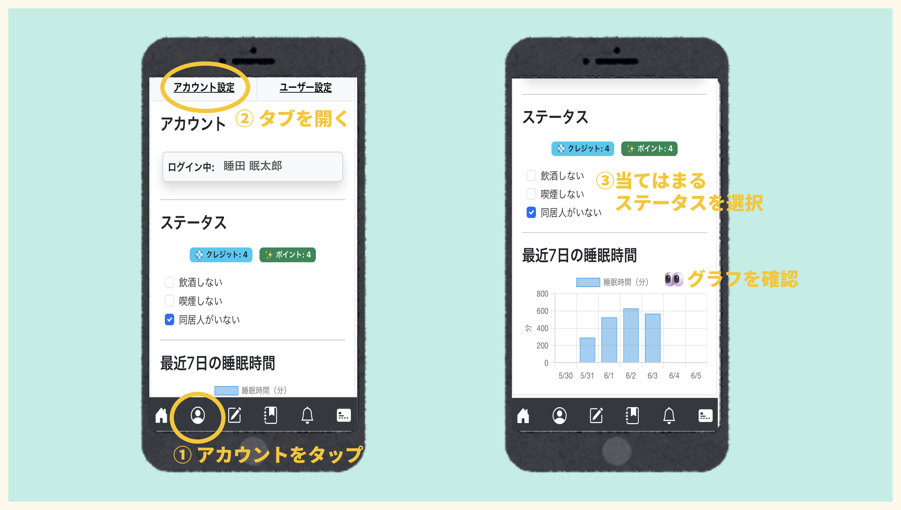

# 睡眠記録アプリ　「ねむログ」
---
### **📒✏️「ねむログ」とは？**
経験サンプリング法の手法を採用し，睡眠と睡眠に関連する行動の測定を可能にする記録アプリです。お手元のスマホやPCで簡単に記録を開始できます。 
 **👇以下のURLから体験できます📱** 
https://sleepema.onrender.com/

---
### **📝記録の手順**
#### **1.アカウント設定**

1️⃣URLにアクセスし開いたホーム画面から，「アカウント」画面を開きます。 
2️⃣ユーザー設定タブを開き，ユーザー名を登録します。 
3️⃣登録ボタンを押すとユーザー登録完了です。

---
#### **2.毎日の睡眠記録**

**【就寝時】** 
1️⃣睡眠日誌画面を開くと，起床時タブが開かれます。 
2️⃣その日の自分の睡眠や起床時の自分の状態についてあてはまる項目を選択します。 
3️⃣「End Sleep」を押すと睡眠時間の計測が終了します。 
🎯寝ようと思ってベッド/布団に入った時に記録すると良いです。

**【起床時】** 
1️⃣睡眠日誌の画面を開きます。 
2️⃣自分のその日一日の行動や記録時の状態について，あてはまる項目を選択します。 
3️⃣「Sleep Start」を押すと睡眠時間の記録が開始します。

---
#### **3.記録の確認**

1️⃣アカウント画面から，アカウント設定タブを開きます。 
2️⃣飲酒，喫煙，同居人の有無等のあてはまるステータスを選択します。 
3️⃣間近7日間の睡眠時間のグラフが確認できます。

---
#### **4.記録の修正　～もし記録を忘れた時は～**

1️⃣履歴画面から修正したい日の記録を選択し，「編集」ボタンを押します。 
2️⃣修正したい項目を入力し直します。 
3️⃣「保存」ボタンを押して修正完了です。

---
### **📫お問い合わせ**
本アプリの研究使用，商用利用，質問など各種お問合せは以下の連絡先にお願いします。 
連絡先: g250304 [at] tokyo-kasei.ac.jp